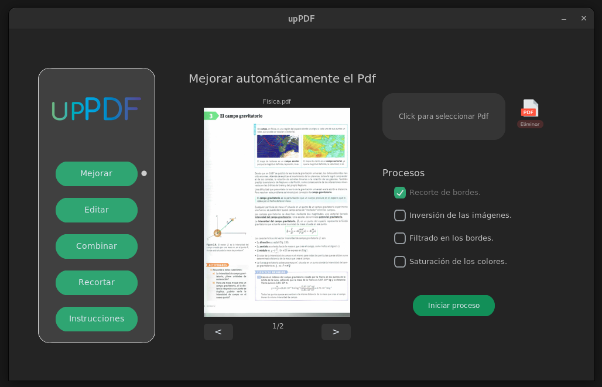
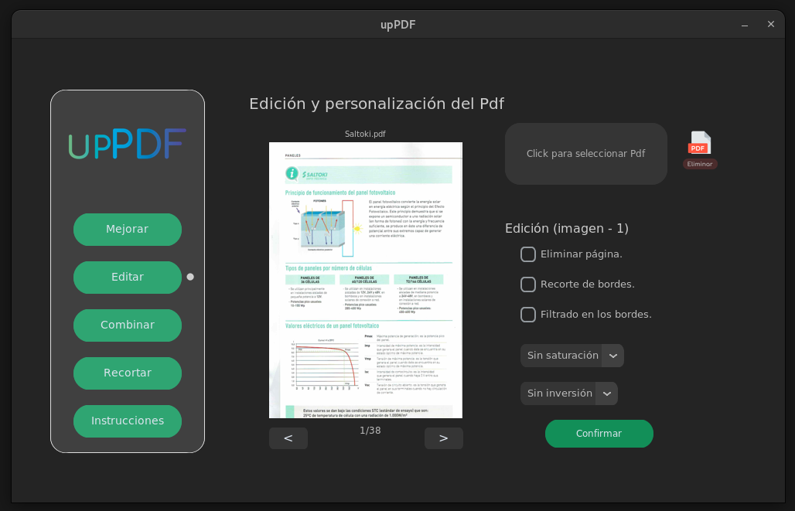
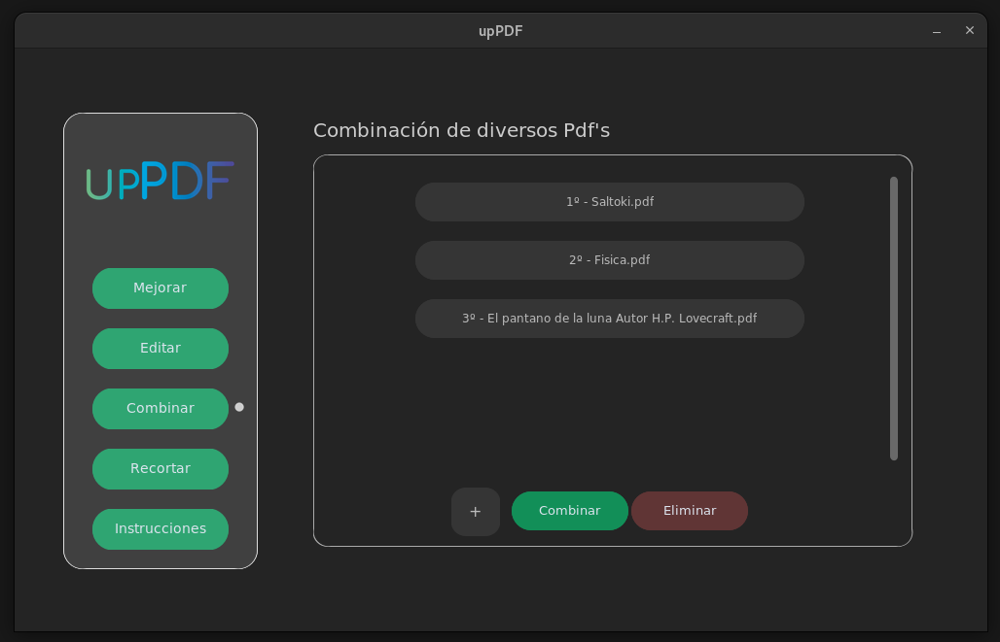
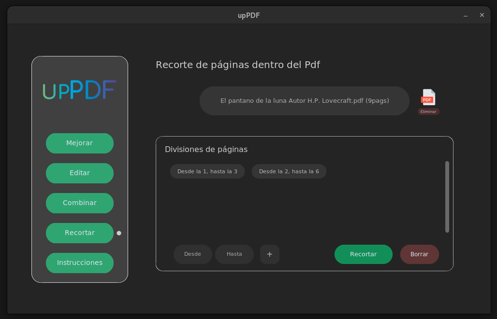

# Tabla de contenidos
* [Información general](#información-general)
* [Instalación y desinstalación](#instalación-y-desinstalación)
* [Estructura del proyecto](#estructura-del-proyecto)
***

### Información general
Este programa permite combinar y recortar cualquier tipo de pdf y procesar pdf's
generados por impresoras con escaneres para dejarlos de forma correcta y ahorrar
mucho tiempo al usuario editandolos manualmente. Por cada página, el programa puede:

*   Detectar y recortar bordes automaticamente.
*   Detectar si la pagina esta invertida en el eje x, en el y, o en ambos, y corregirlo.
*   Filtrar una página para aumentar la nitidez y el contraste.
*   Saturar la página para tener colores más vivos.

#### Secciones del programa
Una vez ejecutado el programa se pueden ver 5 opciones en el menu:

*   Mejorar: Aplica las operaciones que se deseen a todas las páginas del pdf.
*   Editar: Aplica las operaciones que se deseen a la pagina indicada.
*   Combinar: Crear un pdf juntando otros pdf's.
*   Recortar: Crear varios pdf's a partir de un pdf indicando el rango de páginas.
*   Informacion: El manual de usuario.

<p align="center">
    
    
    
    
</p>

***

### Instalación y desinstalación
*   Requisitos: Python 3
*   Disponibilidad: Multiplataforma (Todos los sistemas operativos)

#### Guía de instalacion
1. Clona el repositorio: ` git clone https://github.com/eloyUA/upPDF `
2. Ponte en el directorio: ` cd upPDF `
3. Instala las dependencias: ` python3 setup/instalador_dep.py `
4. Ejecuta el programa (Puede tardar un poco): ` python3 __main__.pyw `

Nota: Si hay algun error, prueba a crear un entorno virtual en la carpeta raíz del 
proyecto ` python3 -m venv __venv__ `, luego vuelve a instalar las dependencias con
el entorno virtual ` __venv__/bin/python3 setup/instalador_dep.py ` y ejecuta el
programa con ` __venv__/bin/python3 __main__.pyw `

Nota: En linux al crear un entorno virtual el ejecutable de python3 esta en ` __venv__/bin `,
esto en Windows y Mac puede ser diferente pero tiene que estar en algun directorio dentro de
` __venv__ `

#### Guía de desinstalacion
1. Ponte en el directorio: ` cd upPDF `
2. Desinstala las dependencias: ` python3 setup/desinstalador_dep.py `
3. Elimina el directorio ` upPDF `

#### Errores comunes (Windows)
Hay 2 tipos de dependencias a instalar:
*   Unas librerías de python (Sin problema, en principio)
*   Un motor para trabajar con texto en imagenes (Tesseract) (No es libreria, es motor)

Para utilizar tesseract con python se necesita la librería ` pytesseract `,
que se instala con el resto de librerías y en princio no debería de haber
problema, y el motor ` Tesseract ` que lo usa esta librería.

Todo lo anterior se va a instalar sin problema, pero puede ser que tesseract
no se agrege a la PATH. Por favor, ejecuta ` where tesseract ` en la terminal,
si aparece la ruta, perfecto, esta en la PATH, sino modifica el codigo fuente:

1. Accede al directorio del proyecto.
2. Abre src/modelo/imagen_escaner.py
3. Debajo de todas las importaciones de librerias escribe:
``` pytesseract.pytesseract.tesseract_cmd = r'C:\\Program Files\\Tesseract-OCR\\tesseract.exe' ```

Con esto ya estaría, prueba a ejecutar el programa. En Linux y Mac no debería de
haber problemas.
***

### Estructura del proyecto
```
LICENSE               La licencia  
README                Este archivo  
pdfs_ej/              Contiene unos PDF's para probar el programa (se puede eliminar)  
setup/                Contiene el instalador y desinstalador de las dependencias
src/                  Contiene el codigo fuente del proyecto

src/__init__.py           Para decirle a Python que upPDF/src/ es un paquete  
src/__main__.pyw          Ejecutable principal  
src/vista/                Contiene ficheros para el GUI  
src/modelo/               Contiene ficheros para trabajar con datos: PDF's, imágenes...  
src/controlador/          Contiene ficheros para comunicar el modelo y la vista  

src/vista/adjuntos/iconos        Contiene imágenes que se usan como iconos  
src/vista/adjuntos/componentes   Contiene ficheros .py que personalizan elementos CTK  
```
